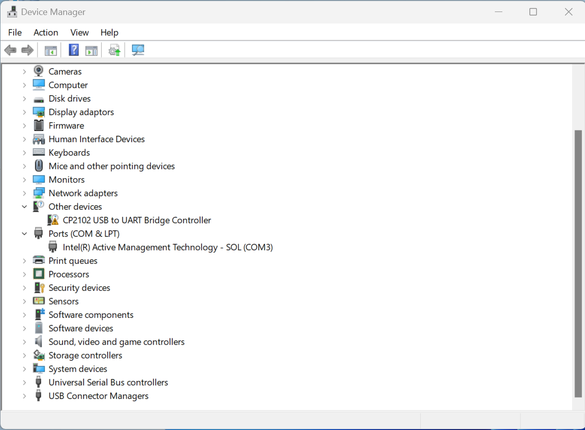
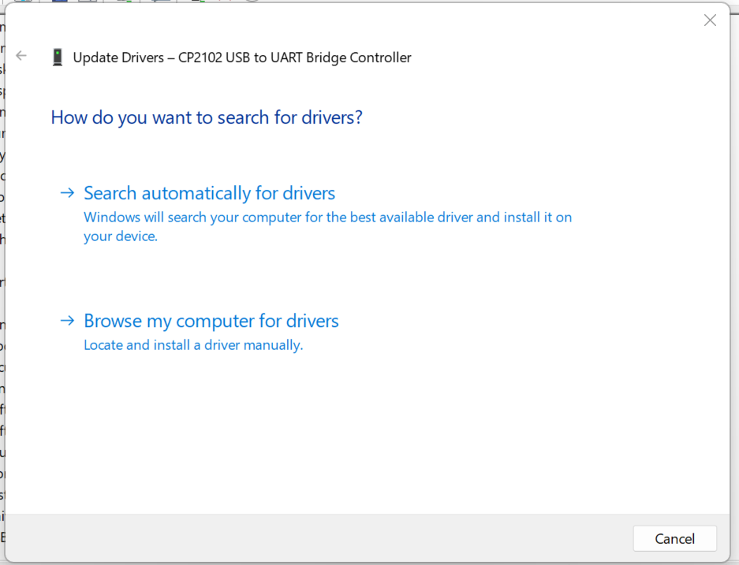
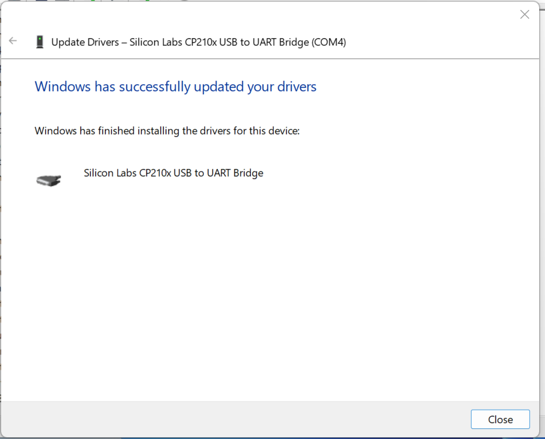

## Driver Installation
1. When you see the following error while flashing ESP32

 - There are two reasons for this error.
   1. The selected Port is not correct.
   2. The Drivers are not installed.
2. In Windows Search, search Device Manager and open it. Scroll down to Ports.

 - If the drivers are not installed you will see the CP2102 USB to UART Bridge Controller.
 - If the Drivers are Installed You will See the Following in the Ports.
 
 - Here the Port is COM7 for the ESP32.
3. To Install the Drivers Right Click on the `CP2102 USB to UART Bridge Controller` and then click on the `Update Driver / Install Driver`.
4. Click on `Browse my Computer from Drivers` for Drivers Installation.

5. Select the `CP2102x_VCP_Windows` folder in the ESP32 Flasher folder you extracted.

6. Click on `Next` and the drivers will be installed in some time. On Successful Installtion you will see the following message.
