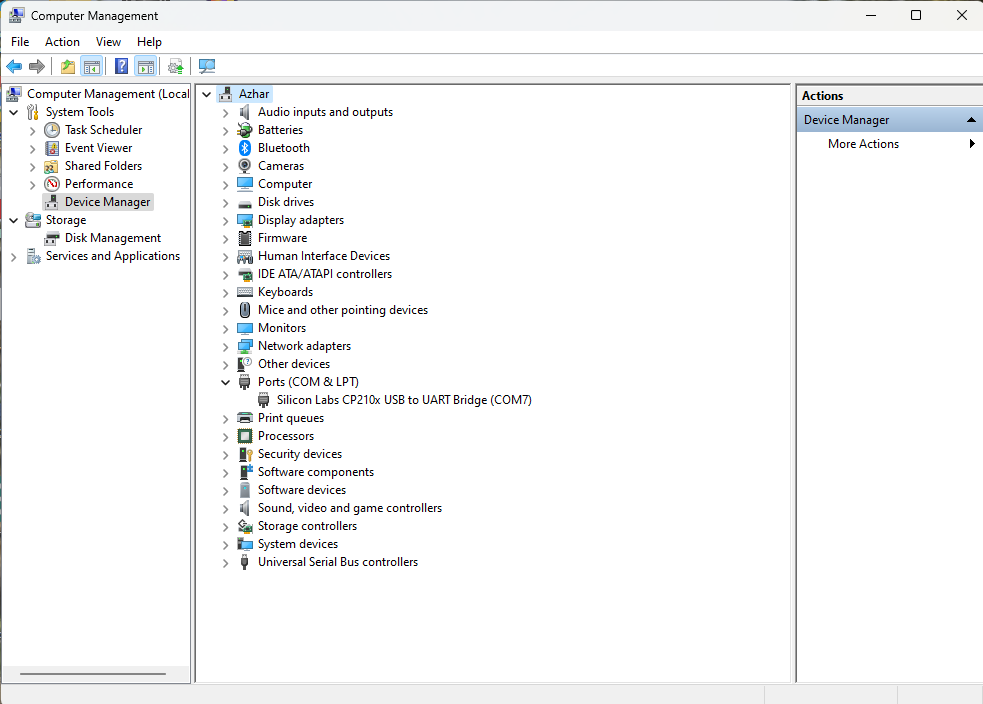

## Driver Installation
1. Connect the ESP32 to the Computer USB Port.
2. In Windows Search, search Device Manager and open it. Scroll down to Ports.

 - If the drivers are not installed you will see the CP2102 USB to UART Bridge Controller.
 - If the Drivers are Installed You will See the Following in the Ports.                                                      
 
 - Here the Port is COM7 for the ESP32.
1. To Install the Drivers Right Click on the `CP2102 USB to UART Bridge Controller` and then click on the `Update Driver / Install Driver`.
2. Click on `Browse my Computer from Drivers` for Drivers Installation.                                                                   

1. Select the `CP2102x_VCP_Windows` folder in the ESP32_Flasher folder to which the esp32_flasher.zip is extracted.

1. Click on `Next` and the drivers will be installed in some time. On Successful Installtion you will see the following message.

#### Uploading Firmware to ESP32
1. Connect ESP32 to Computer USB Port.
2. Get the [ESP_Flasher](https://github.com/3STechLabs-org/ESP32-Flasher/releases/)
3. Double Click on `ESP_Flasher.exe` or the `ESP_Flasher` for MacOS.
4. You will see the following Window.                                      

 - If ESP32 is connected you will see the MCU Connected Message.
1. In Windows Search, search Device Manager and open it. Scroll down to Ports.
 - Here you see the `Silicon Labs CP210x USB to UART Bridge (COM3)`, it means ESP32 is connected to `COM3`.

1. Now Select the Port on which ESP32 is Connected from the Drop Down Menu.                                                

1. Now in the ESP_Flasher tool Click on the `Browse Button` in front of Select Firmware (.zip).                                                 

 - This will open a window for Selecting the `.zip` file of the firmware.

1. Open `release` folder.
 - Here you will find files with `.zip` extension. 
 - Select this file and Click on Open.                                                                             
 
1. You will now see the path of the `.zip` file in the text field.                 

1.   Now Click on the `Flash ESP32` Button.                                
      
1.   It will start flashing the MCU and you will start seeing the progress bar.                                               
 
1. Once the firmware is flashed you will see this screen with `100% Progress Bar`, `Mac Address`, and `Serial Monitor`.                                             

